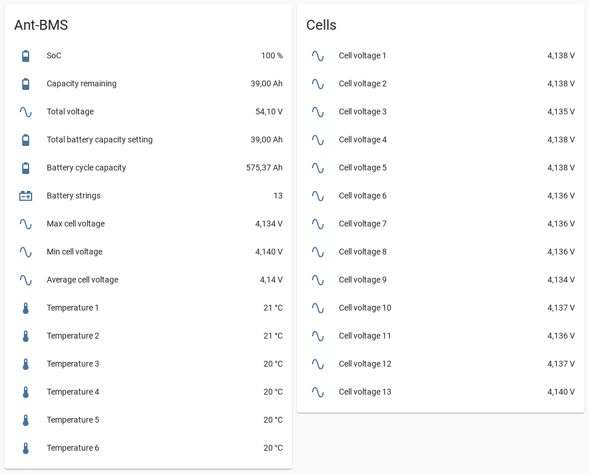

# esphome-ant-bms


[](https://www.buymeacoffee.com/syssi)

ESPHome component to monitor and control a ANT-BMS via UART



## Supported devices

* 16ZMB-TB-7-16S-300A ([7-16S, 300A, 2021-08-12](https://github.com/esphome/feature-requests/issues/1396#issuecomment-1017462249))
* 24AHA-TB-24S-200A ([10-24S, 200A, 2021-09-28](https://github.com/syssi/esphome-ant-bms/issues/36#issuecomment-1086251894))
* ANT 16S 100A ([16S, 100A, 2020](https://github.com/syssi/esphome-ant-bms/issues/28#issuecomment-1069100025))
* ANT 24S 200A ([8-24S, 200A, 2020](https://github.com/syssi/esphome-ant-bms/issues/36#issuecomment-1086251894))

## Untested devices

* ANT H-24S 180A
* ANT 32S 300A

## Requirements

* [ESPHome 2022.2.0 or higher](https://github.com/esphome/esphome/releases).
* Generic ESP32 or ESP8266 board

## Schematics

```
                UART-TTL
┌──────────┐                ┌─────────┐
│          │<----- RX ----->│         │
│ ANT-BMS  │<----- TX ----->│ ESP32/  │
│          │<----- GND ---->│ ESP8266 │<-- 3.3V
│          │<----- 3.3V --->│         │<-- GND
└──────────┘                └─────────┘


│                ANT-BMS                 │
│                                        │
│  Comm                            Temp  │
└─[oooo]──[oooooooo]──[oooooooo]──[oooo]─┘
   ││││
   ││││      (ESP32)    /    (ESP8266)
   ││││
   │││└─ TXD (GPIO16)        (GPIO4)
   ││└── RXD (GPIO17)        (GPIO5)
   │└─── GND (GND)           (GND)
   └──── VCC (3.3V)          (3.3V)
```

The connector is a 4 Pin JST 1.25mm. It's important to connect VCC too because the BMS doesn't respond/start if you connect TXD, RXD and GND only.

https://github.com/syssi/esphome-ant-bms/issues/1#issuecomment-1049048825

## Installation

You can install this component with [ESPHome external components feature](https://esphome.io/components/external_components.html) like this:
```yaml
external_components:
  - source: github://syssi/esphome-ant-bms@main
```

or just use the `esp32-example.yaml` as proof of concept:

```bash
# Install esphome
pip3 install esphome

# Clone this external component
git clone https://github.com/syssi/esphome-ant-bms.git
cd esphome-ant-bms

# Create a secrets.yaml containing some setup specific secrets
cat > secrets.yaml <<EOF
wifi_ssid: MY_WIFI_SSID
wifi_password: MY_WIFI_PASSWORD

mqtt_host: MY_MQTT_HOST
mqtt_username: MY_MQTT_USERNAME
mqtt_password: MY_MQTT_PASSWORD
EOF

# Validate the configuration, create a binary, upload it, and start logs
# If you use a esp8266 run the esp8266-examle.yaml
esphome run esp32-example.yaml

```

## Example response all sensors enabled

```
[sensor:125]: 'ant-bms total voltage': Sending state 54.10000 V with 2 decimals of accuracy
[sensor:125]: 'ant-bms cell voltage 1': Sending state 4.13800 V with 3 decimals of accuracy
[sensor:125]: 'ant-bms cell voltage 2': Sending state 4.13800 V with 3 decimals of accuracy
[sensor:125]: 'ant-bms cell voltage 3': Sending state 4.13500 V with 3 decimals of accuracy
[sensor:125]: 'ant-bms cell voltage 4': Sending state 4.13800 V with 3 decimals of accuracy
[sensor:125]: 'ant-bms cell voltage 5': Sending state 4.13800 V with 3 decimals of accuracy
[sensor:125]: 'ant-bms cell voltage 6': Sending state 4.13600 V with 3 decimals of accuracy
[sensor:125]: 'ant-bms cell voltage 7': Sending state 4.13600 V with 3 decimals of accuracy
[sensor:125]: 'ant-bms cell voltage 8': Sending state 4.13600 V with 3 decimals of accuracy
[sensor:125]: 'ant-bms cell voltage 9': Sending state 4.13400 V with 3 decimals of accuracy
[sensor:125]: 'ant-bms cell voltage 10': Sending state 4.13700 V with 3 decimals of accuracy
[sensor:125]: 'ant-bms cell voltage 11': Sending state 4.13600 V with 3 decimals of accuracy
[sensor:125]: 'ant-bms cell voltage 12': Sending state 4.13700 V with 3 decimals of accuracy
[sensor:125]: 'ant-bms cell voltage 13': Sending state 4.14000 V with 3 decimals of accuracy
[sensor:125]: 'ant-bms current': Sending state 0.00000 A with 1 decimals of accuracy
[sensor:125]: 'ant-bms soc': Sending state 100.00000 % with 0 decimals of accuracy
[sensor:125]: 'ant-bms total battery capacity setting': Sending state 39.00000 Ah with 2 decimals of accuracy
[sensor:125]: 'ant-bms capacity remaining': Sending state 38.99547 Ah with 2 decimals of accuracy
[sensor:125]: 'ant-bms battery cycle capacity': Sending state 575.37402 Ah with 2 decimals of accuracy
[sensor:125]: 'ant-bms temperature 1': Sending state 21.00000 °C with 0 decimals of accuracy
[sensor:125]: 'ant-bms temperature 2': Sending state 21.00000 °C with 0 decimals of accuracy
[sensor:125]: 'ant-bms temperature 3': Sending state 20.00000 °C with 0 decimals of accuracy
[sensor:125]: 'ant-bms temperature 4': Sending state 20.00000 °C with 0 decimals of accuracy
[sensor:125]: 'ant-bms temperature 5': Sending state 20.00000 °C with 0 decimals of accuracy
[sensor:125]: 'ant-bms temperature 6': Sending state 20.00000 °C with 0 decimals of accuracy
[sensor:125]: 'ant-bms charge mosfet status code': Sending state 1.00000  with 0 decimals of accuracy
[text_sensor:067]: 'ant-bms charge mosfet status': Sending state 'On'
[sensor:125]: 'ant-bms discharge mosfet status code': Sending state 1.00000  with 0 decimals of accuracy
[text_sensor:067]: 'ant-bms discharge mosfet status': Sending state 'On'
[sensor:125]: 'ant-bms balancer status code': Sending state 0.00000  with 0 decimals of accuracy
[text_sensor:067]: 'ant-bms balancer status': Sending state 'Off'
[sensor:125]: 'ant-bms power': Sending state 0.00000 W with 1 decimals of accuracy
[sensor:125]: 'ant-bms min cell voltage': Sending state 4.14000 V with 3 decimals of accuracy
[sensor:125]: 'ant-bms max cell voltage': Sending state 4.13400 V with 3 decimals of accuracy
[sensor:125]: 'ant-bms average cell voltage': Sending state 4.13600 V with 2 decimals of accuracy
[sensor:125]: 'ant-bms battery strings': Sending state 13.00000  with 0 decimals of accuracy
[switch:037]: 'ant-bms charging': Sending state ON
[switch:037]: 'ant-bms discharging': Sending state ON
[switch:037]: 'ant-bms balancer': Sending state OFF
[text_sensor:067]: 'ant-bms total runtime formatted': Sending state '6d 7h '
[sensor:124]: 'ant-bms total runtime': Sending state 546592.00000 s with 0 decimals of accuracy
```

## Protocol

### Status frame

| Offset | Len | Example value         | Field                   | Decoded value           | Coeff./Unit |
| ------ | --- | --------------------- | ----------------------- | ----------------------- | ----------- |
|   `0`  | `4` | `0xAA 0x55 0xAA 0xFF` | Header                  |                         |             |
|   `4`  | `2` | `0x02 0x1D`           | Total voltage           | 541 * 0.1 = 54.1V       | 0.1 V       |
|   `6`  | `2` | `0x10 0x2A`           | Cell voltage 1          | 4138 * 0.001 = 4.138V   | 0.001 V     |
|   `8`  | `2` | `0x10 0x2A`           | Cell voltage 2          | 4138 * 0.001 = 4.138V   | 0.001 V     |
|  `10`  | `2` | `0x10 0x27`           | Cell voltage 3          | 4135 * 0.001 = 4.135V   | 0.001 V     |
|  `12`  | `2` | `0x10 0x2A`           | Cell voltage 4          |                         | 0.001 V     |
|  `14`  | `2` | `0x10 0x2A`           | Cell voltage 5          |                         | 0.001 V     |
|  `16`  | `2` | `0x10 0x28`           | Cell voltage 6          |                         | 0.001 V     |
|  `18`  | `2` | `0x10 0x28`           | Cell voltage 7          |                         | 0.001 V     |
|  `20`  | `2` | `0x10 0x28`           | Cell voltage 8          |                         | 0.001 V     |
|  `22`  | `2` | `0x10 0x26`           | Cell voltage 9          |                         | 0.001 V     |
|  `24`  | `2` | `0x10 0x29`           | Cell voltage 10         |                         | 0.001 V     |
|  `26`  | `2` | `0x10 0x28`           | Cell voltage 11         |                         | 0.001 V     |
|  `28`  | `2` | `0x10 0x29`           | Cell voltage 12         |                         | 0.001 V     |
|  `30`  | `2` | `0x10 0x2C`           | Cell voltage 13         |                         | 0.001 V     |
|  `32`  | `2` | `0x00 0x00`           | Cell voltage 14         |                         | 0.001 V     |
|  `34`  | `2` | `0x00 0x00`           | Cell voltage 15         |                         | 0.001 V     |
|  `36`  | `2` | `0x00 0x00`           | Cell voltage 16         |                         | 0.001 V     |
|  `38`  | `2` | `0x00 0x00`           | Cell voltage 17         |                         | 0.001 V     |
|  `40`  | `2` | `0x00 0x00`           | Cell voltage 18         |                         | 0.001 V     |
|  `42`  | `2` | `0x00 0x00`           | Cell voltage 19         |                         | 0.001 V     |
|  `44`  | `2` | `0x00 0x00`           | Cell voltage 20         |                         | 0.001 V     |
|  `46`  | `2` | `0x00 0x00`           | Cell voltage 21         |                         | 0.001 V     |
|  `48`  | `2` | `0x00 0x00`           | Cell voltage 22         |                         | 0.001 V     |
|  `50`  | `2` | `0x00 0x00`           | Cell voltage 23         |                         | 0.001 V     |
|  `52`  | `2` | `0x00 0x00`           | Cell voltage 24         |                         | 0.001 V     |
|  `54`  | `2` | `0x00 0x00`           | Cell voltage 25         |                         | 0.001 V     |
|  `56`  | `2` | `0x00 0x00`           | Cell voltage 26         |                         | 0.001 V     |
|  `58`  | `2` | `0x00 0x00`           | Cell voltage 27         |                         | 0.001 V     |
|  `60`  | `2` | `0x00 0x00`           | Cell voltage 28         |                         | 0.001 V     |
|  `62`  | `2` | `0x00 0x00`           | Cell voltage 29         |                         | 0.001 V     |
|  `64`  | `2` | `0x00 0x00`           | Cell voltage 30         |                         | 0.001 V     |
|  `66`  | `2` | `0x00 0x00`           | Cell voltage 31         |                         | 0.001 V     |
|  `68`  | `2` | `0x00 0x00`           | Cell voltage 32         |                         | 0.001 V     |
|  `70`  | `4` | `0x00 0x00 0x00 0x00` | Current                 | 0.0 A                   | 0.1 A       |
|  `74`  | `1` | `0x64`                | SOC                     | 100 %                   | 1.0 %       |
|  `75`  | `4` | `0x02 0x53 0x17 0xC0` | Total Battery Capacity Setting | 39000000         | 0.000001 Ah |
|  `79`  | `4` | `0x02 0x53 0x06 0x11` | Battery Capacity Remaining     |                  | 0.000001 Ah |
|  `83`  | `4` | `0x00 0x08 0xC7 0x8E` | Battery Cycle Capacity         | 575374 * 0.001 = 575.374 Ah | 0.001 Ah |
|  `87`  | `4` | `0x00 0x08 0x57 0x20` | Uptime in seconds       | 546.592 s               | 1.0 s       |
|  `91`  | `2` | `0x00 0x15`           | Temperature 1           | 21°C                    | 1.0 °C      |
|  `93`  | `2` | `0x00 0x15`           | Temperature 2           | 21°C                    | 1.0 °C      |
|  `95`  | `2` | `0x00 0x14`           | Temperature 3           | 20°C                    | 1.0 °C      |
|  `97`  | `2` | `0x00 0x14`           | Temperature 4           | 20°C                    | 1.0 °C      |
|  `99`  | `2` | `0x00 0x14`           | Temperature 5           | 20°C                    | 1.0 °C      |
|  `101` | `2` | `0x00 0x14`           | Temperature 6           | 20°C                    | 1.0 °C      |
|  `103` | `1` | `0x01`                | Charge MOSFET Status    |                         |             |
|  `104` | `1` | `0x01`                | Discharge MOSFET Status |                         |             |
|  `105` | `1` | `0x00`                | Balancer Status         |                         |             |
|  `106` | `2` | `0x03 0xE8`           | Tire length             |                         | mm          |
|  `108` | `2` | `0x00 0x17`           | Number of pulses per week |                       |             |
|  `110` | `1` | `0x01`                | Relay switch            |                         |             |
|  `111` | `4` | `0x00 0x00 0x00 0x00` | Current power           | 0W                      | 1.0 W       |
|  `115` | `1` | `0x0D`                | Cell with the highest voltage | Cell 13           |             |
|  `116` | `2` | `0x10 0x2C`           | Maximum cell voltage    | 4140 * 0.001 = 4.140V   | 0.001 V     |
|  `118` | `1` | `0x09`                | Cell with the lowest voltage | Cell 9             |             |
|  `119` | `2` | `0x10 0x26`           | Minimum cell voltage | 4134 * 0.001 = 4.134V      | 0.001 V     |
|  `121` | `2` | `0x10 0x28`           | Average cell voltage | 4136 * 0.001 = 4.136V      | 0.001 V     |
|  `123` | `1` | `0x0D`                | Cell count | 13                                   |             |
|  `124` | `2` | `0x00 0x00`           | Discharge MOSFET, voltage between D-S             | 0.1 V       |
|  `126` | `2` | `0x00 0x73`           | Drive voltage (discharge MOSFET) |                | 0.1 V       |
|  `128` | `2` | `0x00 0x6F`           | Drive voltage (charge MOSFET)    |                | 0.1 V       |
|  `130` | `2` | `0x02 0xA7`           | When the detected current is 0, the initial value of the comparator | | |
|  `132` | `4` | `0x00 0x00 0x00 0x00` | Battery is in balance bitmask (Bit 1 = Cell 1, Bit 2 = Cell 2, ...) | | |
|  `136` | `2` | `0x11 0x62`           | System log / overall status bitmask?              | |
|  `138` | `2` | `0x0B 0x00`           | CRC                                               | |

## Known issues

* ESP32: Adding all supported sensors can lead to a stack overflow / boot loop. This can be solved by increasing the stack size. ([#36][i36])
* A command queue / command scheduling would be nice. At the moment changing settings via the switch entities isn't reliable.

[i36]: https://github.com/syssi/esphome-ant-bms/issues/36#issuecomment-1085529679

## Debugging

If this component doesn't work out of the box for your device please update your configuration to enable the debug output of the UART component and increase the log level to the see outgoing and incoming serial traffic:

```
logger:
  level: DEBUG

uart:
  id: uart0
  baud_rate: 19200
  rx_buffer_size: 384
  tx_pin: ${tx_pin}
  rx_pin: ${rx_pin}
  debug:
    direction: BOTH
```

## References

* https://github.com/klotztech/VBMS/wiki/Serial-protocol
* https://github.com/esphome/feature-requests/issues/1396
* https://github.com/imval/AntBMS/blob/main/AntBMS.cpp
* https://diysolarforum.com/threads/for-those-of-you-looking-to-monitor-your-ant-bms-with-pi3-via-bluetooth.6726/
* https://github.com/RoboDurden/AntBms-Arduino
